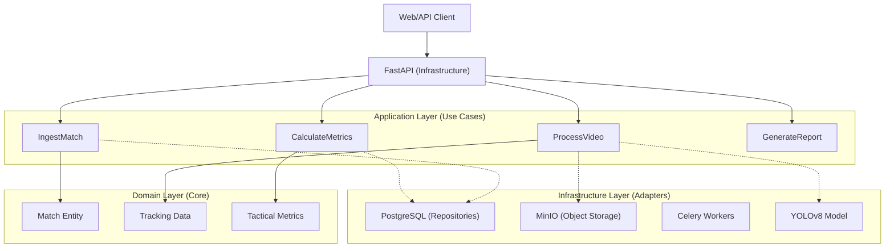
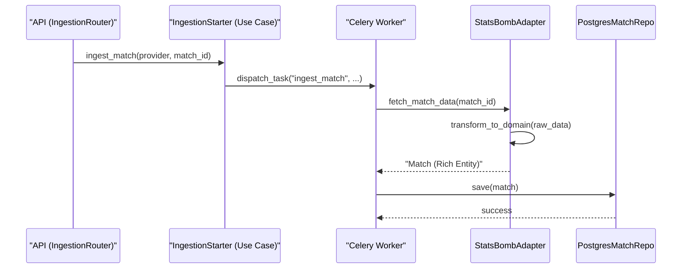
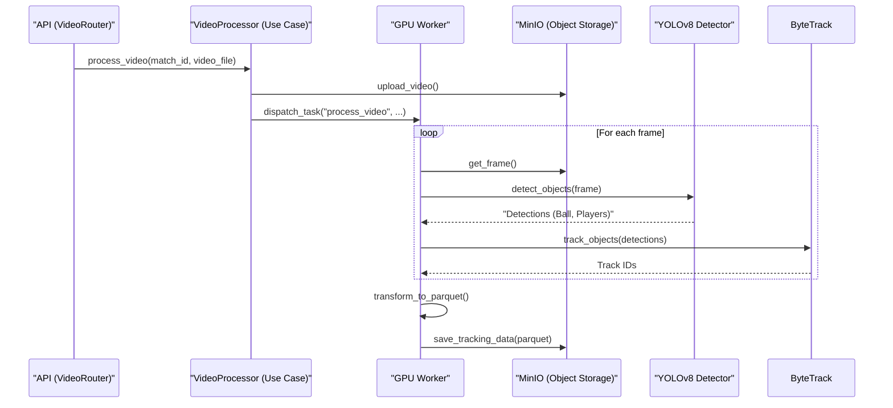
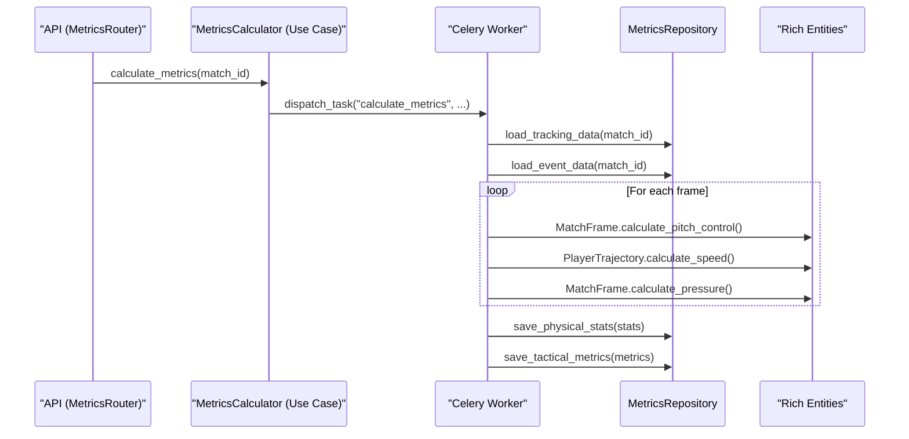
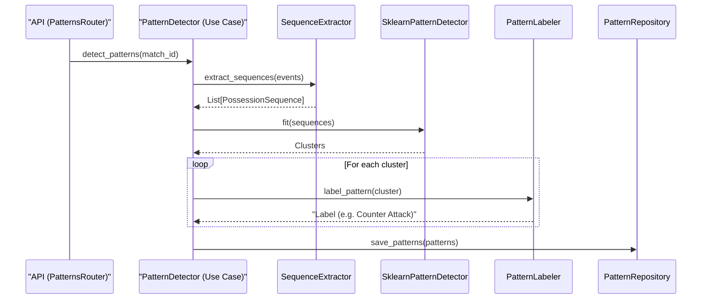
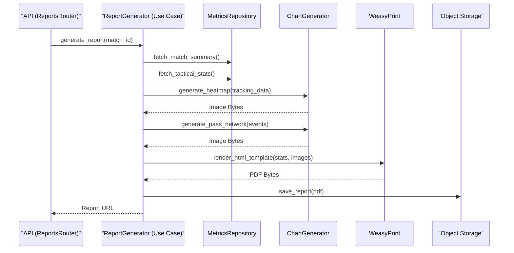
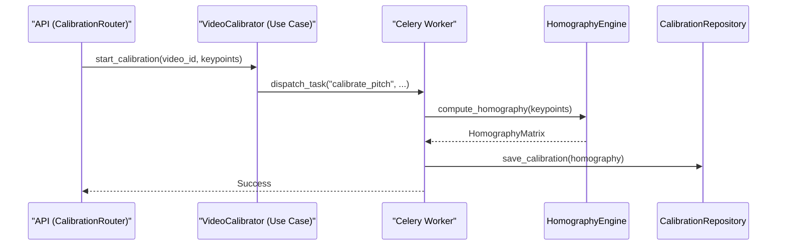
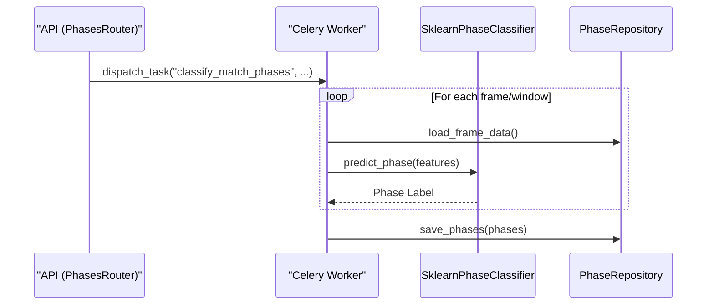
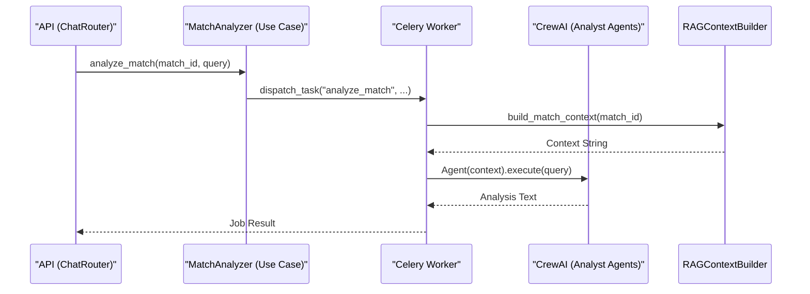

# 🏗️ Architecture & Flow Diagrams

This document visualizes the workflows of the implemented features in the Football Intelligence Engine.

## 1. System Overview (Hexagonal Architecture)

## 2. Data Ingestion Flow

## 3. Video Processing Pipeline (GPU)

## 4. Tactical Metrics Calculation

## 5. Pattern Detection (Unsupervised ML)

## 6. Report Generation

## 7. Pitch Calibration

## 8. Phase Classification

## 9. Agentic Match Analysis (CrewAI)

